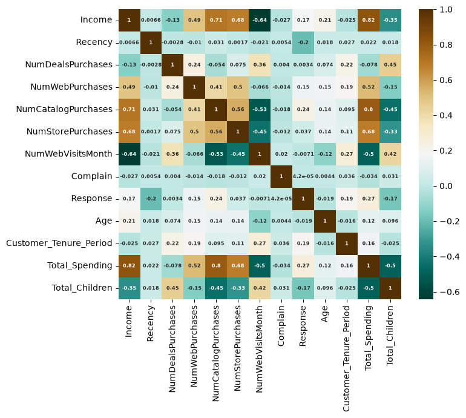
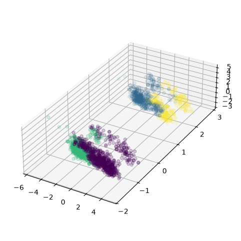

# 🛒 shopper-pulse: Unsupervised Customer Segmentation

An end-to-end Machine Learning project utilizing **Principal Component Analysis (PCA)**, **K-Means**, and **Agglomerative Hierarchical Clustering** to segment e-commerce customers into actionable buyer personas.

---

## 📌 Project Overview
**shopper-pulse** analyzes customer transaction patterns to identify distinct purchasing cohorts. By translating raw retail data into data-driven buyer personas, marketing teams can optimize campaign strategies, tailor loyalty programs, and maximize conversion rates.

---

## 📈 Key Experimental Results

### 1. Model Selection & Optimal K Evaluation
To determine the natural grouping of customers, we evaluated clustering performance across $K \in [1, 10]$ using **WCSS (Elbow Method)** and **Silhouette Analysis**:

- **Elbow Point (Kneedle Algorithm):** Located at $K = 4$, indicating the point of diminishing returns for intra-cluster variance.
- **Silhouette Coefficient:** Evaluated across clusters to ensure high separation and cohesion.
- **Dimensionality Reduction:** 3 Principal Components retained the majority of structural variance while enabling 3D cluster spatial plotting.

---

## 📊 Customer Persona & Profiling Matrix

The final **Agglomerative Hierarchical Clustering ($K=4$)** model yielded four distinct, business-actionable customer profiles:

| Cluster | Persona Name | Key Demographics & Habits | Preferred Channels | Strategic Business Recommendation |
| :---: | :--- | :--- | :--- | :--- |
| **C0** | **Premium VIPs** | High Income, High Spending, Older Age, Low Web Browsing | Catalog, In-Store, Web | **High ROI Segment:** Focus on exclusive product previews, VIP customer support, and premium tiers. |
| **C1** | **Family Shoppers** | Moderate Income, Higher Children Count, High Web Browsing | Web Browsing, Store | **Volume & Value:** Target with family-bundle discounts, digital coupons, and back-to-school deals. |
| **C2** | **Budget Browsers** | Low Income, High Web Visits, Lowest Conversion Rate | Web Browsing | **Incentivize Action:** Use automated cart-recovery emails, flash sales, and heavy promotional discounts. |
| **C3** | **Profitable Loyalty** | High Income, High Spending, Partnered, Low Web Browsing | Store, Catalog | **Retention Focus:** Reward with high-value loyalty perks, subscription models, and personalized cross-selling. |

---

## 🎨 Visualizations

You can view key model charts generated during analysis:
<table>
  <tr>
    <td width="50%" align="center">
      <br>
      <sub><b>Figure 1:</b> Multi-feature correlation matrix after scaling.</sub>
    </td>
    <td width="45%" align="center">
      <br>
      <sub><b>Figure 2:</b> Spatial distribution of customer clusters across 3 PCs.</sub>
    </td>
  </tr>
</table>

---

## 🛠️ Data Pipeline & Methodology

1. **Data Preprocessing:** Imputed missing values (`Income`), engineered features (`Age`, `Customer_Tenure_Period`, `Total_Spending`, `Total_Children`), and removed extreme outliers.
2. **Feature Scaling & Encoding:** Applied `OneHotEncoder` for categorical columns and standardized features via `StandardScaler`.
3. **Clustering & Profiling:** Dimensionality reduction via PCA (3 components) followed by K-Means and Agglomerative Hierarchical Clustering.

---

## 🚀 How to Run Locally

1. **Clone the repository:**
   ```bash
   git clone [https://github.com/your-username/shopper-pulse.git](https://github.com/your-username/shopper-pulse.git)
   cd shopper-pulse